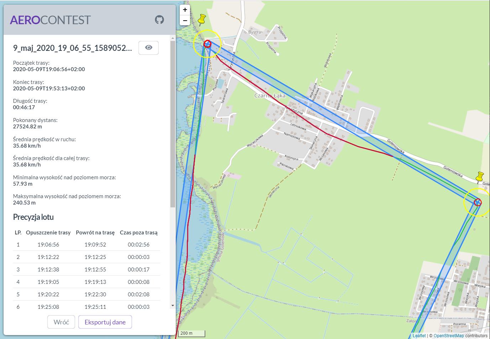

## Aerocontest

Aerocontest is an application created for aeroclub in Szczecin. Their amateur flying contests and issues with reliable contest result analysis spawned the idea for this app. 

The app will overlay `kml` flight track definition and any number of flight route recordings persisted in `gpx` format over a map, show some flight parameters for every recording, and calculate time spent outside of the predefined flight track (the main competition, for now).  

Please note this project is in a very early stage, test data is hardcoded and not all functionality is implemented yet.

 

#### TODO

* Analysis export/print
* Ability to edit and delete/ignore flight recording points
* `kmz` support
* Data persistence
* Front-end stuff
* Flight recording position interpolation for higher accuracy
